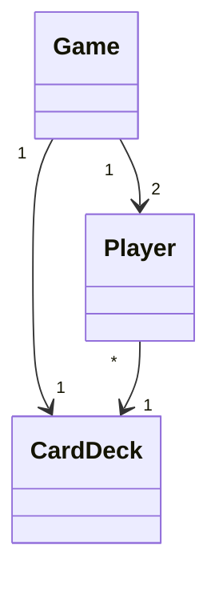
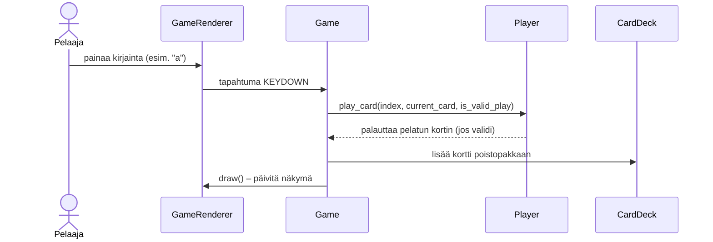

## Sovelluslogiikka

```mermaid
classDiagram
    Game "1" --> "1" CardDeck
    Game "1" --> "2" Player
    Player "*" --> "1" CardDeck
```

## Päätoiminnallisuus

### Pelaajan kortin pelaaminen

Kun pelaaja valitsee kortin (esim. painamalla "a") ja kortti on sääntöjen mukainen, tapahtuu seuraavaa:

```mermaid
sequenceDiagram
  actor Pelaaja
  participant GameRenderer
  participant Game
  participant Player
  participant CardDeck

  Pelaaja->>GameRenderer: painaa kirjainta (esim. "a")
  GameRenderer->>Game: tapahtuma KEYDOWN
  Game->>Player: play_card(index, current_card, is_valid_play)
  Player-->>Game: palauttaa pelatun kortin (jos validi)
  Game->>CardDeck: lisää kortti poistopakkaan
  Game->>GameRenderer: draw() – päivitä näkymä
```
