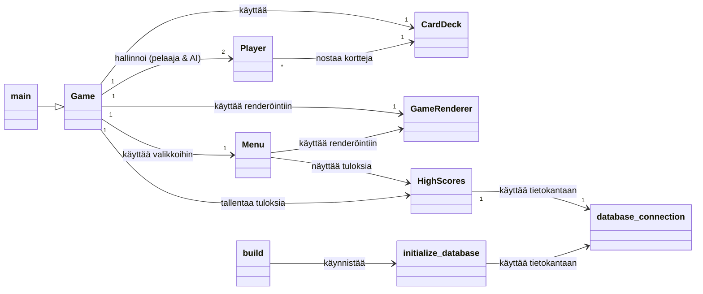
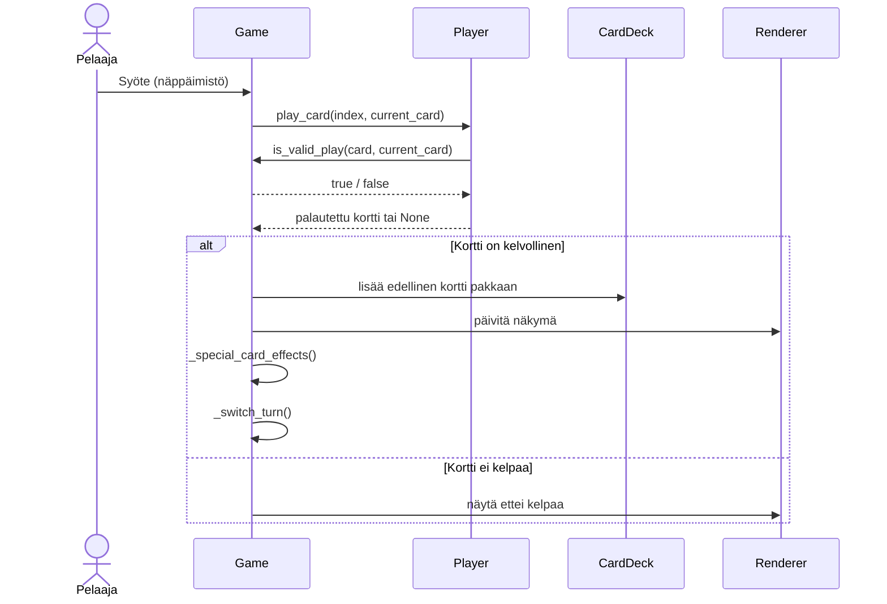

# Arkkitehtuurikuvaus

Tämä dokumentti kuvaa sovelluksen korkean tason rakennetta, keskeisiä komponentteja ja niiden välisiä suhteita.

## Rakenne

Sovelluksen tiedostorakenne on yksinkertainen: pääosa koodista sijaitsee juurihakemistossa, ja data-tiedostot (`instructions.yaml`, `database.sqlite`) sijaitsevat `data`-alihakemistossa.

Alla oleva kaavio osoittaa, että Game-luokka toimii keskeisenä toiminnan ohjaajana, joka hallinnoi pelin tilaa ja käyttää muita moduuleja (Player, CardDeck, GameRenderer, Menu, HighScores) tarpeen mukaan. Player- ja CardDeck-luokat edustavat pelin dataa ja sen käsittelyä tällä tasolla. GameRenderer ja Menu vastaavat käyttöliittymän esittämisestä. HighScores ja database_connection muodostavat pysyväistallennuksen osan.

## Käyttöliittymä

Käyttöliittymä on toteutettu Pygame-kirjaston avulla ja se koostuu pääasiassa kahdesta moduulista:

- renderer.py: Sisältää GameRenderer-luokan, joka vastaa pelitilanteen (kortit kädessä, poistopakan ylin kortti, vuoro, pisteet) ja pelin päättymisnäkymän piirtämisestä ruudulle.

- menu.py: Sisältää Menu-luokan, joka hoitaa päävalikon, ohjeiden ja ranking-listan näyttämisen ja käyttäjän navigoinnin näissä näkymissä. Menu-luokka kommunikoi HighScores-luokan kanssa rankingin näyttämiseksi.

Käyttöliittymä (erityisesti GameRenderer) on vahvasti sidoksissa Game-luokkaan, sillä GameRenderer.draw()-metodi ottaa Game-olion parametrinaan ja lukee suoraan sen tilaa piirtääkseen näytön.

## Sovelluslogiikka

Sovelluksen keskeinen sovelluslogiikka sijaitsee game.py-tiedostossa olevassa Game-luokassa. Tämä luokka hallinnoi pelin kulkua, pelaajien vuoroja, korttien peluuta, erikoiskorttien efektejä, pelin sääntöjä (is_valid_play) ja pelin päättymistilanteita.

Sovelluslogiikka käyttää muita moduuleja:

- deck.py (CardDeck): Vastaa korttipakan ja poistopakan hallinnasta ja korttien jakamisesta.

- player.py (Player): Edustaa sekä ihmispelaajaa että tekoälypelaajaa. Kapseloi pelaajan käden ja perustoiminnot (nosta kortti, pelaa kortti). Game-luokka kutsuu Player-olioiden metodeja pelaajan tai tekoälyn toimenpiteiden suorittamiseksi.

Vaikka Game-luokka sisältää suurimman osan sääntölogiikasta, is_valid_play on staattisena metodina eristetty Game-luokkaan, jotta sitä voidaan käyttää helposti muualta (esim. Player-luokasta kortin pelaamisen validoinnissa).

## Tietojen pysyväistallennus

Sovellus tallentaa high scoret pysyvästi SQLite-tietokantaan. Tästä vastaavat moduulit:

- database_connection.py: Tarjoaa funktion get_database_connection tietokantayhteyden luomiseen ja palauttamiseen.

- initialize_database.py: Sisältää logiikan tietokannan (tässä tapauksessa highscores-taulun) alustamiseksi, poistamalla ja luomalla taulun tarvittaessa. Tätä skriptiä ajetaan yleensä erikseen (esim. build.py-skriptin kautta).

- high_scores.py (HighScores): Tarjoaa korkeamman tason rajapinnan tulosten lisäämiseen (add_score) ja hakemiseen (get_top_scores). Tämä luokka käyttää database_connection.py:n tarjoamaa yhteyttä.

Game-luokka käyttää HighScores-luokkaa tallentaakseen pelaajan tuloksen pelin päätyttyä voittoon. Menu-luokka käyttää HighScores-luokkaa näyttääkseen ranking-listan.

## Päätoiminnallisuudet

Kuvataan seuraavaksi sovelluksen toimintalogiikka muutaman päätoiminnallisuuden osalta.

### Pelin käynnistys

Sovellus käynnistyy main.py-tiedoston main()-funktion suorituksella. Tämä luo GameRenderer- ja Game-oliot, ja käynnistää pelin pääsilmukan kutsumalla game.run(). Game-olion alustaminen (__init__) luo samalla CardDeck- ja Player-oliot ja nostaa ensimmäisen kortin. game.run() kutsuu aluksi menu.show_main_menu(), joka siirtyy päävalikkoon.

### Pelaajan vuoro

Pelaajan syöte käsitellään GameRendererin kautta, joka välittää tapahtuman Game-luokan _player_turn-metodille. _player_turn kutsuu _play_card-metodia pelaajaoliolle. Player.play_card tarkistaa kelpoisuuden Game.is_valid_play-metodilla. Jos peli on validi, kortti poistetaan kädestä, lisätään poistopakkaan, näkymä päivitetään, erikoiskortin efektit käsitellään ja vuoro vaihtuu tai pelaaja saa toisen vuoron.

### Tekoälyn vuoro

Tekoälyn vuoro käynnistyy automaattisesti Game-luokassa ajastimen (pending_ai_action, ai_delay_ms) avulla tai pelaajan nostettua kortin. _ai_turn-metodi yrittää ensin pelata kelvollisen kortin kutsumalla _play_card-metodia tekoälyoliolle. Jos korttia ei voida pelata, tekoäly nostaa kortin Player.draw_card-metodilla. Vuoro siirtyy pelaajalle tekoälyn toimenpiteiden jälkeen, ellei tekoäly saanut toista vuoroa erikoiskortin ansiosta.

