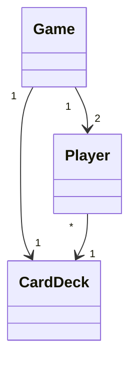
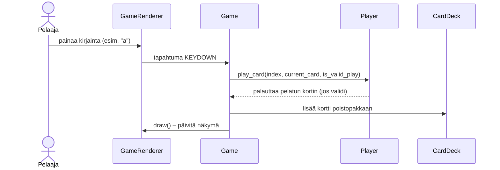

# Alustava arkkitehtuurikuvaus

## Yleiskuvaus

Sovellus on yksinkertainen tekstipohjainen Uno-tyylinen korttipeli, joka on rakennettu Pythonilla ja Pygame-kirjastolla. Sovellus noudattaa modulaarista rakennetta, jossa eri vastuualueet on jaettu eri tiedostoihin. Keskeiset komponentit ovat:

- `deck.py`: Korttipakan logiikka (korttien luonti, sekoitus, nostaminen).
- `player.py`: Pelaajan toiminnot ja käden hallinta.
- `game.py`: Pelilogiikka ja vuorojen hallinta.
- `renderer.py`: Käyttöliittymän renderöinti Pygamella.
- `main.py`: Sovelluksen käynnistys.

## Hakemistorakenne

Tiedostot sijoittuvat samaan hakemistoon, eikä erillisiä alihakemistoja ole tällä hetkellä käytössä.

## Sovelluslogiikka

Yllä oleva luokkakaavio esittää olioiden väliset suhteet:

- Game-luokka hallinnoi koko pelin tilaa: vuorot, kortit ja AI:n toiminnan.

- Jokaisella pelaajalla (ihminen ja tietokone) on viittaus samaan korttipakkaan (CardDeck).

- Korttipakka hoitaa korttien jakamisen ja poistopakan ylläpidon.

## Keskeinen toiminnallisuus: Pelaajan kortin pelaaminen

Yllä oleva sekvenssikaavio kuvaa, mitä tapahtuu, kun pelaaja valitsee kortin painamalla näppäintä:

- Pelaajan syöte: Pelaaja painaa näppäintä (esim. 'a'), joka vastaa tiettyä korttia hänen kädessään.
- Rendererin käsittely: GameRenderer tunnistaa näppäinpainalluksen ja välittää tiedon Game-luokalle KEYDOWN-tapahtumana.
- Pelin logiikan käsittely: Game-luokka käsittelee tapahtuman handle_player_turn-metodissa. Se kutsuu pelaajan play_card-metodia.
- Pelaajan kortin pelaaminen: Player-luokan play_card-metodi tarkistaa onko valittu kortti olemassa pelaajan kädessä ja onko se sääntöjen mukainen peli meneillään olevaan korttiin verrattuna (is_valid_play-funktiolla). Jos peli on validi, kortti poistetaan pelaajan kädestä ja palautetaan Game-luokalle.
- Pakan päivittäminen: Game-luokka lisää pelatun kortin poistopakkaan CardDeck-olion avulla.
- Näkymän päivittäminen: Lopuksi Game-luokka kutsuu GameRendererin draw()-metodia päivittääkseen pelitilanteen näytölle.
