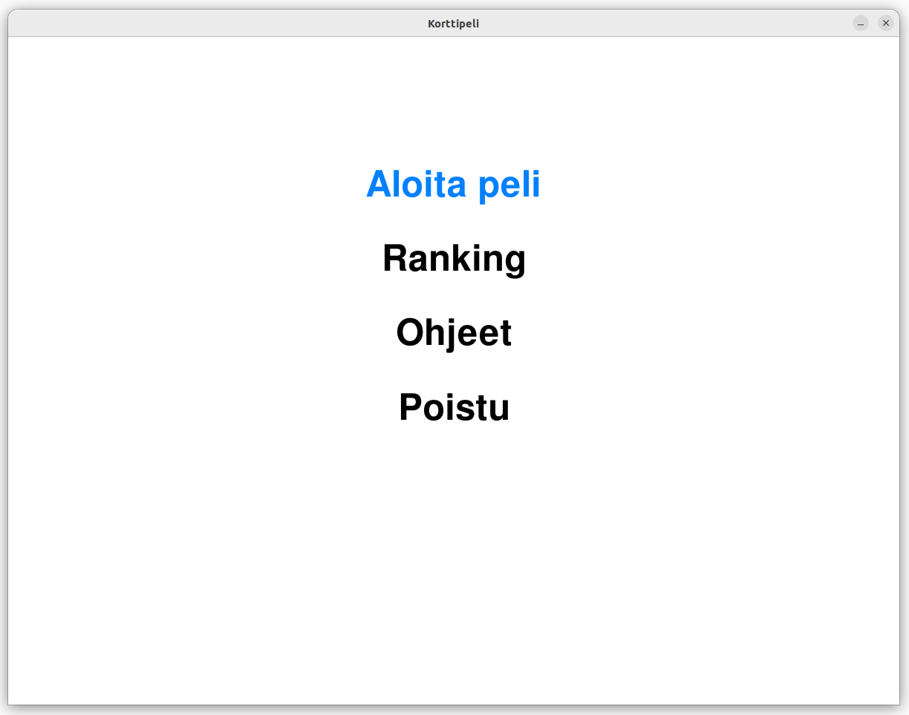
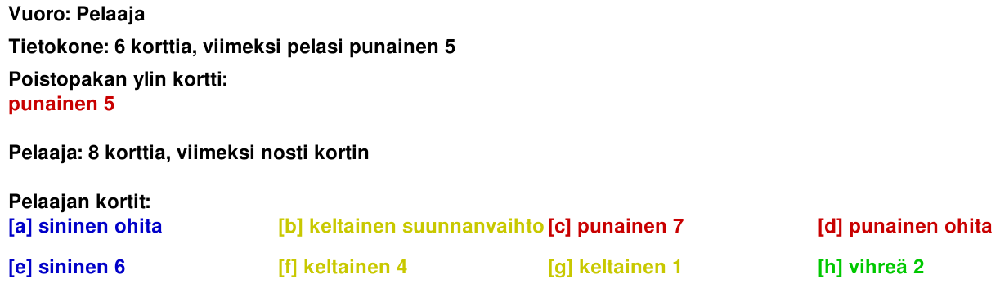

# Korttipelin käyttöohjeet

Sovellus on digitaalinen versio korttipelistä, jossa pelaajat pyrkivät pääsemään eroon korteistaan noudattaen pelin sääntöjä. Kortteja voi pelata, jos ne vastaavat värin tai numeron (0-9) perusteella pöydällä olevaa korttia. Pelissä on myös erikoiskortteja, jotka vaikuttavat pelin kulkuun. Sovellus tarjoaa yksinpelin tekoälyvastustajaa vastaan.

## Ohjelman käynnistäminen

1. Ennen ohjelman käynnistämistä, asenna riippuvuudet:

```
poetry install
```

2. Alusta tietokanta:

```
poetry run invoke build
```

3. Käynnistä ohjelma:

```
poetry run invoke start
```

## Päävalikko



Kuva on miltä peli näyttää kun pelin käynnistää. Voit valita YLÖS / W ja ALAS / S näppäimillä ja ENTER näppäimellä valikosta haluatko aloittaa pelin, katsoa rankingin, katsoa pelin ohjeet tai poistua. 

## Pelaaminen

### Pika-ohjeet
    - SPACE nosta kortti
    - WASD / suuntanäppäimet + ENTER liiku ja valitse pelattava kortti, väri yms.
    - ESC Muualla kuin pelissä palaa päävalikkoon
    - Yläkulman ruksia painamalla voit sulkea pelin 

### Tarkemmat ohjeet



Kuva on miltä peli näyttää kun pelin aloittaa. Ruudulla ylävasemmalla on tieto siitä kenen vuoro on, montako korttia kullakin pelaajalla on, mikä poistopakan ylin kortti on ja näiden tietojen alla näkyy pelaajan kortit.

- Valitse pelattava kortti (joko numero tai väri on sama kuin poistopakan ylin kortti tai kortti on villi-kortti) selaamalla kortteja WASD/suuntanäppäimillä ja valitsemalla kortti ENTER näppäimellä.

- Erikoiskortit, jotka vaikuttavat pelin kulkuun:
    - Pelaamalla värillisiä ohitus- ja suunnanvaihto-kortteja pelaaja saa vastustajan menettämään vuoronsa. 
    - Pelaamalla värillinen nosta 2 kortti pelaaja laittaa vastustajan nostamaan 2 korttia ja menettämään vuoronsa.
    - Pelaamalla villin kortin pelaaja voi valita seuraavaksi pelattavan kortin värin.
    - Pelaamalla villin nosta 4 kortin pelaaja voi valita seuraavaksi pelattavan kortin värin sekä laittaa vastustajan nostamaan 4 korttia ja menettämään vuoronsa.

- Jos sinulla ei ole pelattavaa korttia niin paina ENTER ja saat yhden kortin lisää ja vuoro vaihtuu. 

- Kun pelaaja tai tietokone on pelannut vuoronsa ruudulla näkyy korttien määrän vieressä mitä kukin pelaaja viimeksi teki.

- Kun pelaaja tai tietokone pääsee eroon korteistaan peli loppuu (voitto/häviö), näet voittajan saamat pisteet ja voit valita haluatko palata päävalikkoon vai sammuttaa pelin.

- Jos kortteja nostaa enemmän kuin 30 eri rivejä kortteja voi selata YLÖS ja ALAS näppäimillä.

- Jos pakasta nostetaan kaikki kortit tulee tasapeli.

- Voit sulkea sovelluksen milloin tahansa painamalla yläkulman ruksia.
