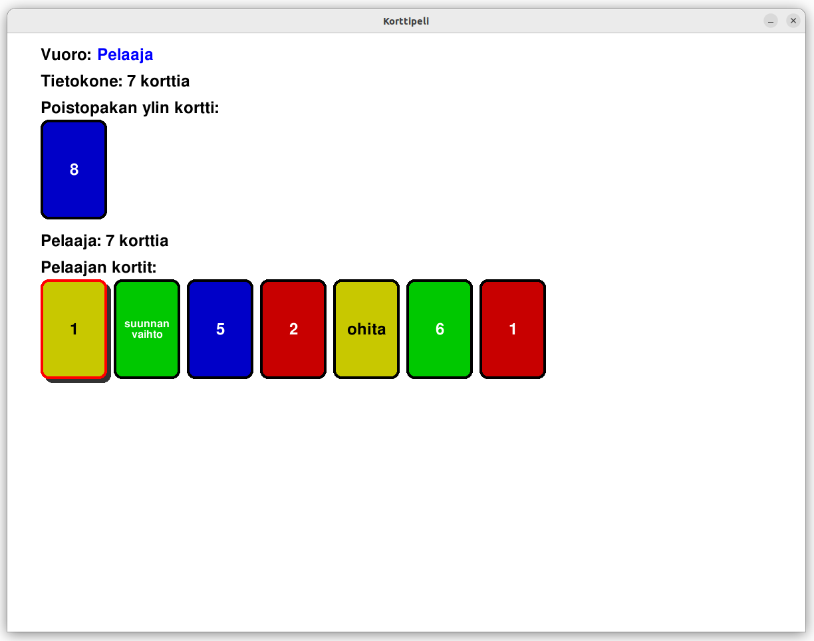

# Korttipelin käyttöohjeet

Sovellus on digitaalinen tekstipohjainen versio korttipelistä, jossa pelaajat pyrkivät pääsemään eroon korteistaan noudattaen pelin sääntöjä. Kortteja voi pelata, jos ne vastaavat värin tai numeron (0-9) perusteella pöydällä olevaa korttia tai ovat villejä kortteja. Pelissä on myös erikoiskortteja, jotka vaikuttavat pelin kulkuun. Sovellus tarjoaa yksinpelin tekoälyvastustajaa vastaan.

## Pelaaminen

Kuva on miltä peli näyttää kun pelin käynnistää. Ruudulla ylävasemmalla on tieto siitä kenen vuoro on, montako korttia kullakin pelaajalla on, mikä poistopakan ylin kortti on ja näiden tietojen alla näkyy pelaajan kortit, joilla on jokaisella oma kirjain kortin nimen edessä. 

- Valitse pelattava kortti (joko numero tai väri on sama kuin poistopakan ylin kortti tai kortti on villi-kortti) painamalla kortin kirjaimen (a-z) nappia. 

- Erikoiskortit, jotka vaikuttavat pelin kulkuun:
    - Pelaamalla värillisiä ohitus- ja suunnanvaihto-kortteja pelaaja saa vastustajan menettämään vuoronsa. 
    - Pelaamalla värillinen nosta 2 kortti pelaaja laittaa vastustajan nostamaan 2 korttia ja menettämään vuoronsa.
    - Pelaamalla villin kortin pelaaja voi valita seuraavaksi pelattavan kortin värin.
    - Pelaamalla villin nosta 4 kortin pelaaja voi valita seuraavaksi pelattavan kortin värin sekä laittaa vastustajan nostamaan 4 korttia ja menettämään vuoronsa.

- Jos sinulla ei ole pelattavaa korttia niin paina enter ja saat yhden kortin lisää ja vuoro vaihtuu. 

Kun pelaaja tai tietokone on pelannut vuoronsa ruudulla näkyy korttien määrän vieressä mitä kukin pelaaja viimeksi teki, kuten yläpuolella olevassa kuvassa näkyy. 

- Kun pelaaja tai tietokone pääsee eroon korteistaan peli loppuu (voitto/häviö) ja voit valita haluatko pelata uuden pelin vai lopettaa.

- Jos pakasta nostetaan kaikki kortit tulee tasapeli.

- Voit sulkea sovelluksen milloin tahansa painamalla yläkulman ruksia.
