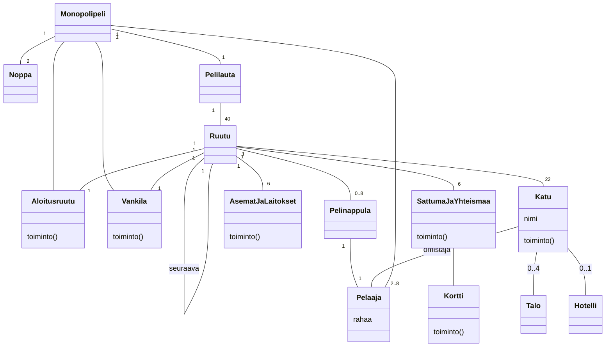

```mermaid
classDiagram
    Monopolipeli "1" -- "2" Noppa
    Monopolipeli "1" -- "1" Pelilauta
    Monopolipeli -- Aloitusruutu
    Monopolipeli -- Vankila
    Pelilauta "1" -- "40" Ruutu
    Ruutu "1" -- "1" Ruutu : seuraava
    Ruutu "1" -- "0..8" Pelinappula
    Ruutu "1" -- "1" Aloitusruutu
    Ruutu "1" -- "1" Vankila
    Ruutu "1" -- "6" SattumaJaYhteismaa
    Ruutu "1" -- "6" AsematJaLaitokset
    Ruutu "1" -- "22" Katu
    Pelinappula "1" -- "1" Pelaaja
    Pelaaja "2..8" -- "1" Monopolipeli
    Pelaaja : rahaa
    Katu : nimi
    Katu : toiminto()
    Katu -- Talo : 0..4
    Katu -- Hotelli : 0..1
    Katu -- Pelaaja : omistaja
    AsematJaLaitokset : toiminto()
    Aloitusruutu : toiminto()
    Vankila : toiminto()
    SattumaJaYhteismaa -- Kortti
    SattumaJaYhteismaa : toiminto()
    Kortti : toiminto()
```